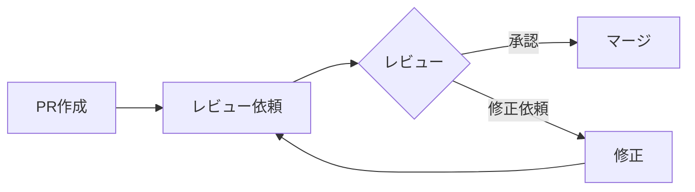

# TiDB移行プロジェクト - 開発ワークフロー

## 目次

- [ブランチ戦略](#ブランチ戦略)
- [コミット戦略](#コミット戦略)
- [PR（プルリクエスト）戦略](#prプルリクエスト戦略)
- [レビュープロセス](#レビュープロセス)
- [ドキュメンテーション](#ドキュメンテーション)
- [進捗管理](#進捗管理)
- [本番デプロイフロー](#本番デプロイフロー)

---

## ブランチ戦略

### 基本方針

**各フェーズを直接mainにマージする**

理由：
- Phase 1のコード変更は後方互換性がある（デフォルト値でRDS接続を維持）
- Phase 6まで本番環境に影響しない（環境変数変更まで既存動作を継続）
- 長寿命のfeatureブランチを管理する必要がない
- 各フェーズが独立してレビュー・マージされる

### ブランチ構成

```text
main (本番環境)
  ├── feature/phase1-tidb-code-support
  ├── feature/phase2-tidb-setup-docs
  ├── feature/phase8-tidb-rds-removal
  └── ...
```

### ブランチ命名規則

| 作業内容 | 命名規則 | 例 |
|---------|---------|-----|
| 全フェーズ | `feature/phase{N}-tidb-{description}` | `feature/phase1-tidb-code-support` |
| | | `feature/phase0-tidb-investigation` |
| | | `feature/phase8-tidb-rds-removal` |

**注**: ドキュメントのみ、インフラのみの作業も含めて全て `feature/` プレフィックスを使用。

### ブランチライフサイクル

#### 1. フェーズごとのブランチ作成

```bash
# mainから最新を取得
git checkout main
git pull origin main

# フェーズ用ブランチを作成
git checkout -b feature/phase1-tidb-code-support
```

#### 2. 作業・コミット

```bash
# 作業を進める
git add <files>
git commit -m "feat(tidb): Add port and sslMode configuration support"
git push -u origin feature/phase1-tidb-code-support
```

#### 3. PR作成・マージ

```bash
# GitHub上でPR作成
# レビュー完了後、mainにマージ
# マージ後、ブランチ削除
```

### ブランチ保護ルール

- **main**: 直接pushは禁止、PR経由のみ
- PRマージ後、作業ブランチは削除

---

## コミット戦略

### コミットメッセージ規則

**フォーマット**:
```
<type>(<scope>): <subject>

<body>

<footer>
```

**タイプ**:
- `feat`: 新機能追加
- `fix`: バグ修正
- `docs`: ドキュメント変更
- `refactor`: リファクタリング
- `test`: テスト追加・修正
- `chore`: ビルド、設定ファイル等の変更

**スコープ**:
- `tidb`: TiDB関連
- `config`: 設定ファイル
- `migration`: マイグレーション関連
- `infra`: インフラ（Terraform等）

### コミット例

#### 例1: コード変更

```
feat(tidb): Add port and sslMode configuration support

- Add port parameter to DatabaseConfiguration.MySql
- Add sslMode parameter for TLS connection support
- Update Migration.kt to use dynamic port and SSL settings
- Maintain backward compatibility with existing RDS setup

Related: TiDB Migration Phase 1
```

#### 例2: ドキュメント追加

```
docs(tidb): Add detailed migration plan

- Create migration-plan.md with 8 phases
- Add risk analysis and rollback strategies
- Include timeline and success criteria
- Add code examples and commands

Related: TiDB Migration Phase 0
```

#### 例3: 設定変更

```
feat(config): Add MYSQL_PORT and MYSQL_SSL_MODE env vars

- Add MYSQL_PORT with default 3306
- Add MYSQL_SSL_MODE with default DISABLED
- Update application.conf to support new parameters

This allows flexible database configuration for both RDS and TiDB.

Related: TiDB Migration Phase 1
```

### コミット粒度

#### 推奨
- ✅ 1つの論理的変更 = 1コミット
- ✅ 独立してレビュー可能な単位
- ✅ ビルドが通る状態

#### 非推奨
- ❌ 複数の無関係な変更を1コミットに
- ❌ コミットメッセージが "WIP" や "fix" だけ
- ❌ ビルドが通らない状態でコミット

---

## PR（プルリクエスト）戦略

### PR作成タイミング

各フェーズ完了時にPRを作成し、**mainに直接マージ**。

| フェーズ | PRタイミング | マージ先 | 備考 |
|---------|------------|---------|------|
| Phase 0 | 調査完了後（ドキュメントのみ） | `main` | 本番環境に影響なし |
| Phase 1 | コード変更完了、テストパス後 | `main` | 後方互換性あり、本番環境に影響なし |
| Phase 2 | セットアップ手順ドキュメント完成後 | `main` | ドキュメントのみ |
| Phase 3-5 | 各フェーズ完了後（オプション） | `main` | ドキュメントのみ |
| Phase 6 | 本番切り替え後、安定稼働確認後 | `main` | 環境変数変更のドキュメント |
| Phase 8 | クリーンアップ完了後 | `main` | インフラ変更（RDS削除） |

**重要**: Phase 1のコード変更は後方互換性があり、デフォルト値でRDS接続を維持するため、mainにマージしても本番環境に影響しない。

### PRテンプレート

**タイトル例**:
```
[TiDB Migration] Phase 1: Add TiDB connection support
```

**PR説明例**:

```markdown
## 概要

TiDB Serverless移行のフェーズ1: アプリケーションコードをTiDB対応にする変更。

## 変更内容

### コード変更
- `DatabaseConfiguration.MySql` にポート番号とSSLモードのパラメータ追加
- `application.conf` に `MYSQL_PORT` と `MYSQL_SSL_MODE` 環境変数追加
- `Migration.kt` を動的なポート番号とSSL設定に対応

### 後方互換性
- デフォルト値により既存のRDS接続も問題なく動作
- 環境変数未設定の場合は従来通りの動作

## テスト

- [x] ローカル環境（Docker Compose + MySQL）で動作確認
- [x] ユニットテストパス
- [ ] TiDB環境で接続テスト（Phase 3で実施予定）

## 関連ドキュメント

- [移行計画](../migration-plan.md#フェーズ1-アプリケーションコード修正)

## チェックリスト

- [x] コードがビルドできる
- [x] 既存のテストがパスする
- [x] コミットメッセージが規則に従っている
- [x] 後方互換性が保たれている
- [ ] レビュー完了

## レビュワーへの注意事項

- TiDB接続用の変更ですが、デフォルト値により既存環境への影響はありません
- Phase 3でTiDB環境での動作確認を行います
```

### PRサイズ

#### 推奨サイズ
- **Small**: 50-200行（1-2時間でレビュー可能）
- **Medium**: 200-500行（半日でレビュー可能）

#### 大きすぎる場合
- フェーズをさらに細分化
- 複数のPRに分割

---

## レビュープロセス

### レビュアー

- **コード変更**: 宮戸 + 蔵人川（相互レビュー）
- **ドキュメント**: 宮戸
- **インフラ変更**: 宮戸

### レビュー観点

#### コード変更
- [ ] 後方互換性が保たれているか
- [ ] テストがパスするか
- [ ] コーディング規約に従っているか
- [ ] エッジケースが考慮されているか
- [ ] エラーハンドリングが適切か

#### ドキュメント
- [ ] 正確性（コマンド、手順が正しいか）
- [ ] 完全性（必要な情報が全て含まれているか）
- [ ] 明確性（分かりやすいか）
- [ ] 再現性（手順通りに実行できるか）

#### インフラ変更
- [ ] 既存環境への影響がないか
- [ ] ロールバック手順が明確か
- [ ] セキュリティリスクがないか

### レビューフロー



### レビューコメント例

#### 承認
```
LGTM! 後方互換性も保たれていて、テストもパスしています。
Phase 3での動作確認が楽しみです。
```

#### 修正依頼
```
コード自体は良いですが、以下の点を確認させてください：

1. `sslMode` が `REQUIRED` でも `DISABLED` でもない値の場合のハンドリングは？
2. ポート番号が範囲外（0-65535外）の場合のバリデーションは必要？

軽微な点なので、確認後にマージで問題ありません。
```

---

## ドキュメンテーション

### ドキュメント構成

```
docs/projects/tidb/
├── README.md                    # プロジェクト概要
├── migration-plan.md            # 詳細な移行計画
├── development-workflow.md      # 開発ワークフロー（本ドキュメント）
├── phase-reports/               # 各フェーズの実施報告
│   ├── phase0-investigation.md
│   ├── phase1-code-changes.md
│   ├── phase3-local-test.md
│   ├── phase6-production-cutover.md
│   └── phase8-cleanup.md
└── troubleshooting.md           # トラブルシューティング
```

### フェーズ実施報告の作成

各フェーズ完了後に実施報告を作成する。

**テンプレート**: `docs/projects/tidb/phase-reports/phase{N}-{name}.md`

```markdown
# Phase {N}: {タイトル}

## 実施日時
- 開始: YYYY-MM-DD HH:MM
- 終了: YYYY-MM-DD HH:MM
- 所要時間: XX時間XX分

## 実施者
- 宮戸
- 蔵人川

## 実施内容

### 計画通りに実施したこと
- [ ] タスク1
- [ ] タスク2

### 計画から変更したこと
- 変更内容と理由

## 結果

### 成功条件の達成状況
- [x] 条件1: 達成
- [x] 条件2: 達成

### 実施したコマンド

\`\`\`bash
# 実際に実行したコマンド
\`\`\`

### 出力結果

\`\`\`
# コマンドの出力
\`\`\`

## 問題・課題

### 発生した問題
- 問題1: 説明と対応

### 未解決の課題
- 課題1: 次フェーズで対応予定

## 学び・気づき

- 学び1
- 学び2

## 次のステップ

- [ ] Phase {N+1}の準備
- [ ] ドキュメント更新
```

### ドキュメント更新タイミング

| タイミング | 更新内容 |
|----------|---------|
| フェーズ開始前 | 計画の最終確認・更新 |
| フェーズ実施中 | コマンド実行結果のメモ |
| フェーズ完了後 | 実施報告作成 |
| 問題発生時 | トラブルシューティングに追記 |

---

## 進捗管理

### GitHub Issues活用

各フェーズをIssueとして管理。

#### Issue作成例

**タイトル**: `[TiDB Migration] Phase 1: Application Code Changes`

**説明**:
```markdown
## 目的
TiDB接続に対応するためのアプリケーションコード修正

## タスク
- [ ] DatabaseConfiguration.MySqlにport, sslModeパラメータ追加
- [ ] application.conf更新
- [ ] Migration.kt更新
- [ ] ローカルテストでの動作確認
- [ ] ドキュメント更新

## 成功条件
- コードがビルドできる
- 既存のテストがパスする
- 後方互換性が保たれている

## 関連
- 移行計画: docs/projects/tidb/migration-plan.md#phase1
- PR: #XXX（作成後にリンク）

## 担当
@蔵人川

## 期限
YYYY-MM-DD
```

### 進捗報告

週次で進捗を報告（社内チャット、Issue等）。

**例**:
```markdown
## TiDB移行プロジェクト - 週次報告 (2025-01-20)

### 今週の進捗
- ✅ Phase 0: 事前調査完了
  - データサイズ: 2.3GB（無料枠内）
  - 月間クエリ数見積もり: 約2000万RU（無料枠内）
- ✅ Phase 1: コード変更完了、PR作成
  - PR #123: レビュー待ち

### 来週の予定
- Phase 1のマージ
- Phase 2: TiDBアカウント作成
- Phase 3: ローカルテスト開始

### 課題・リスク
- なし

### その他
- 移行計画ドキュメント作成完了
```

---

## 本番デプロイフロー

### Phase 0-5: 準備フェーズ

**アプリケーションのデプロイ不要**（ローカル・開発環境のみでの作業）

- Phase 0: ドキュメントのみ
- Phase 1: コード変更はmainにマージ済み、本番デプロイ済み（後方互換性により影響なし）
- Phase 2-5: ドキュメント・手順の記録のみ

### Phase 6: 本番切り替え

#### デプロイ手順

1. **事前準備**
   ```bash
   # Phase 6の実施報告ドキュメントを準備（切り替え後に作成）
   # 必要に応じてPRを作成（ドキュメントのみ）
   ```

2. **切り替え直前**
   ```bash
   # EC2にSSH接続
   ssh -i ~/.ssh/kottage.pem ec2-user@<ec2-ip>

   # 最新コードをpull（必要な場合）
   cd ~/kottage
   git pull origin main  # または適切なブランチ

   # 環境変数バックアップ
   cp .env .env.backup_$(date +%Y%m%d_%H%M%S)

   # 環境変数更新（TiDB接続情報）
   vi .env
   ```

3. **アプリケーション再起動**
   ```bash
   # 再起動
   docker-compose down
   docker-compose up -d

   # ログ確認
   docker logs kottage -f
   ```

4. **動作確認**
   ```bash
   # ヘルスチェック
   curl https://<your-domain>/api/v1/health

   # データ確認
   curl https://<your-domain>/api/v1/entries
   ```

5. **完了報告**
   - GitHub Issueを更新
   - 実施報告ドキュメント作成
   - チームに報告

### Phase 8: クリーンアップ

#### Terraform変更のデプロイ

1. **PRマージ**
   ```bash
   # Phase 8用ブランチで作業
   git checkout main
   git pull origin main
   git checkout -b feature/phase8-tidb-rds-removal

   # db.tf, security_group.tf編集
   # コミット
   git add backend/infra/db.tf backend/infra/security_group.tf
   git commit -m "chore(infra): Remove RDS resources after TiDB migration"

   # PR作成してmainにマージ
   # レビュー・マージ
   ```

2. **Terraform適用**
   ```bash
   cd backend/infra

   # 変更確認
   terraform plan

   # 適用
   terraform apply
   ```

3. **確認**
   ```bash
   # RDS削除確認
   aws rds describe-db-instances --region us-east-2

   # アプリケーション動作確認
   curl https://<your-domain>/api/v1/health
   ```

---

## ロールバックフロー

### Phase 6でのロールバック

問題が発生した場合の即座のロールバック手順。

```bash
# EC2にSSH接続
ssh -i ~/.ssh/kottage.pem ec2-user@<ec2-ip>

# 環境変数を元に戻す
cp .env.backup_YYYYMMDD_HHMMSS .env

# アプリケーション再起動
docker-compose down
docker-compose up -d

# 動作確認
curl https://<your-domain>/api/v1/health
```

**所要時間**: 1-2分

### コードのロールバック

```bash
# mainブランチに問題のあるコードがマージされた場合
git revert <commit-hash>
git push origin main

# または
git reset --hard <previous-commit>
git push --force origin main  # 注意: force pushは慎重に
```

---

## まとめ

### 開発フローの全体像

```text
1. Issue作成（各フェーズ）
   ↓
2. ブランチ作成（feature/phase{N}-tidb-{name}）
   ↓
3. 実装・ドキュメント作成
   ↓
4. コミット（規則に従う）
   ↓
5. PR作成（テンプレート使用）
   ↓
6. レビュー
   ↓
7. マージ（main）← 各フェーズごとにmainにマージ
   ↓
8. フェーズ実施報告作成
   ↓
9. 次のフェーズへ
```

### 重要な原則

- 📝 **ドキュメント第一**: 作業前に計画、作業後に報告
- 🔄 **レビュー必須**: すべてのコード変更はレビューを経る
- 🎯 **小さく頻繁に**: 大きなPRより小さなPRを頻繁に
- ✅ **テスト徹底**: マージ前に必ずテストパス確認
- 🚨 **ロールバック準備**: 常にロールバック可能な状態を保つ

### 次のステップ

1. このドキュメントをチーム内でレビュー
2. GitHub ProjectまたはIssueの準備
3. Phase 0の開始

---

**最終更新**: 2025-01-16
**作成者**: 蔵人川
